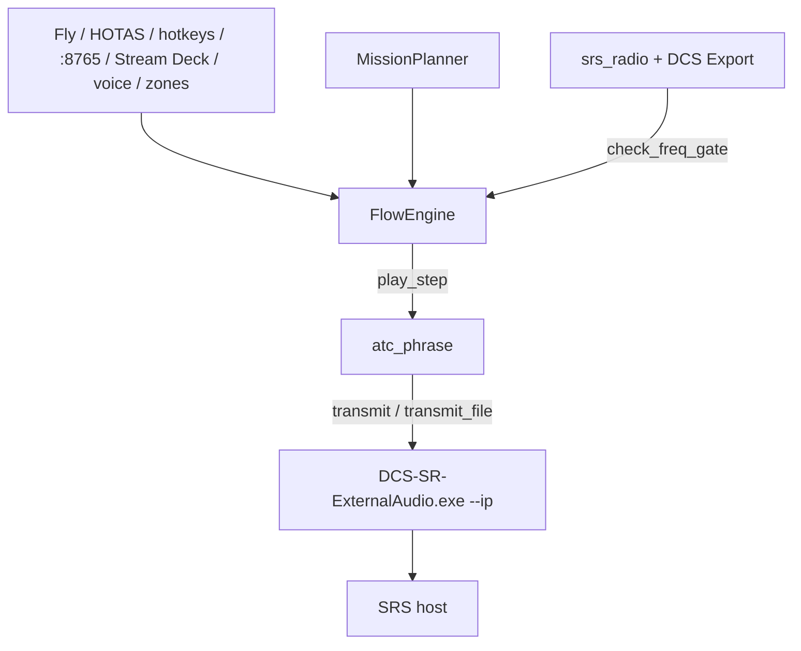
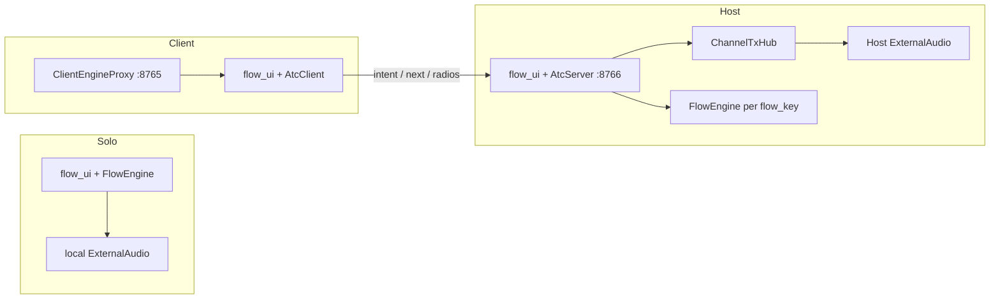
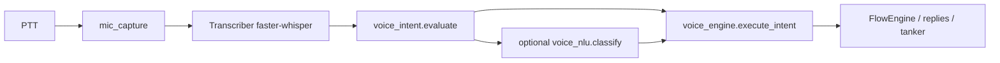

# Architecture

Maintainer overview of how PitBoss is structured and how a mission step becomes an SRS transmission. Operator how-tos stay in [`ATC.md`](ATC.md) and [`TOOLS.md`](TOOLS.md).

## What this repo is

A **Python mission-flow planner** (Tk UI) that builds ATC / C2 radio phrases from Opus flight data and METAR, then transmits them through a patched **DCS-SR-ExternalAudio** binary to a **remote** SRS host (`--ip`). Optional pieces: multi-pilot Host/Client LAN, local Whisper voice control, position-driven auto clearances via drawn airport zones, and Stream Deck / HOTAS triggers.

## Layout

| Path | Role |
|------|------|
| `DCS-SR-ExternalAudio.exe` + DLLs | Slim Windows build with remote `--ip` / hostname support |
| `runtimes\win-x64\` | Native Speech / gRPC libs for ExternalAudio |
| `atc\` | Flow planner UI, engine, phrases, voice, Host/Client, Stream Deck scripts |
| `tools\` | Zone editor / route-tester map server and geo import helpers |
| `patches\` | Source patches + rebuild notes for ExternalAudio |
| `docs\` | Maintainer docs (this file) |

## Entry points

Launchers live under `atc\`. Setup / Flight Flow / Host all start the same app.

| Launcher | Starts | Notes |
|----------|--------|--------|
| `Open-ATC-Setup.cmd` | `flow_ui.py` | Same `MissionPlanner` UI (title “ATC Host”) |
| `Open-Flight-Flow.cmd` | `flow_ui.py` | Same UI (title “ATC Flow”) |
| `Start-ATC-Host.cmd` | `flow_ui.py` | Alias for the dedicated-server Host box |
| `Open-Zone-Editor.cmd` | `tools\zone_server.py` | Map editor on `zone_editor_port` (default 8777) |
| `Open-Route-Tester.cmd` | `tools\zone_server.py --page tester` | Map-jet / route tester (`/tester`) |
| `Install-DCS-Radio-Export.cmd` | `install_dcs_radio_export.py` | DCS Export hook for the frequency gate |
| `Test-Fake-Pilots.cmd` | `fake_pilots.py` | Simulated clients against a local Host |
| `streamdeck\*.cmd` | HTTP or CLI into the flow | Expect local control server on `flow_http_port` (default 8765) |

`_find_python.cmd` locates `python.exe` with tcl/tk for the other launchers.

## UI modes

Tabs inside one process (`flow_ui.MissionPlanner`), not separate executables:

1. **Plan Flight** — author the sortie timeline (template / custom text / audio file)
2. **Fly** — Next / Back / Reset / Flip, freq gate, voice tips, live position
3. **Traffic** — Host-only connected pilots and per-channel TX queues
4. **Setup** — Opus, airport/SRS, TTS, Squadron role, Controls
5. **Help** — in-app operator docs

**Squadron role** (Setup): `solo` | `host` | `client` (`atc_role` in config). Solo is the default single-PC path.

Legacy: `atc_ui.py` is an older phrase-board UI; day-to-day use is `flow_ui.py`.

## End-to-end flow (solo)

Narrative:

1. A trigger calls `FlowEngine.next` / `play_step` (or voice/`play_id`, or a zone auto-fire).
2. External Advance (hotkey, HOTAS, Stream Deck URL, voice step-fire) runs `_freq_gate_or_raise` unless bypassed. On-screen **Play** is not blocked by the gate.
3. `play_step` resolves Opus/METAR and radio params, then `atc_phrase.build_flow_step_phrase` (templates via `build_template_text`, or custom text / file).
4. `FlowEngine.emit_radio` calls `atc_phrase.transmit` or `transmit_file`, which launches ExternalAudio with `--ip={airport srs_host}` on the step frequency.
5. Local HTTP `start_http_server` on `flow_http_port` (8765) exposes `/next`, `/back`, `/seek`, `/reset`, `/flip`, `/status` for Stream Deck and scripts.

## Host / Client

- **`session_key`** (`atc_net.session_key`) — per seat: radios, TTS cap, Traffic row.
- **`flow_key`** (`atc_net.flow_key`) — shared timeline cursor for the same Opus flight.
- Host runs `AtcServer` + `PilotSession`s; TX is queued through `ChannelTxHub` (Ground serializes; other agencies can overlap Ground).
- Clients run STT / hotkeys locally and POST to the Host. They do **not** transmit ATC via ExternalAudio.
- Auth: shared `atc_token` (`X-ATC-Token`). Operator setup: [`ATC.md`](ATC.md) (Multi-pilot).

## Voice pipeline

`VoiceController` owns listen/transcribe. Grammar and addressing live in `voice_intent`; optional LLM remap (`voice_nlu`) only maps onto allowed intents and never invents clearances. On a Client, matched intents are forwarded to the Host for TX. Phrase tables and gates: [`ATC.md`](ATC.md) (Voice control).

## Position / zones

- Drawn areas live in `atc/airports.json`, edited by `tools/zone_server.py` (port `zone_editor_port`, default 8777).
- `runway_position` converts CAOC (or map-jet) tracks to zone containment, dwell, and settled checks.
- Built-in auto clearances (takeoff when in position, monitor tower at EOR) plus any step `trigger` on Plan Flight.
- Field must be `calibrated` (centreline + in-position) for the built-in runway triggers; authored zone triggers do not wait on that flag.
- Details: [`TOOLS.md`](TOOLS.md).

## Data files

| File / dir | Role |
|------------|------|
| `atc/config.json` | From `config.example.json`: Opus, TTS, `flow_file`, ports, Squadron, controls, gates |
| `atc/airports.json` | Per-field SRS host/freqs, runways, taxi, **zones**, calibrated flag |
| `atc/flows/*.json` | Mission timelines (`steps`, templates, triggers, voice phrases) |
| `atc/approaches/` | VFR recoveries / instrument plates (e.g. Nellis NAFBI rules) |
| `atc/departures/` | SID / Flex visual departure catalogs |
| `atc/fixes.json` | Extra lat/lon for route tokens |
| `atc/nttr_navpoints.json` | Bundled NTTR named points for tester / labels |
| `atc/secrets/` | Host-only Google TTS JSON (gitignored) |
| `atc/flow_state.json` / related state | Runtime cursor / sticky UI state |
| Repo `global.cfg` / `default.cfg` | Stubs; live SRS mic/UDP settings come from the **installed** SRS Client config |

## Spine APIs

| Layer | Symbols |
|-------|---------|
| UI | `flow_ui.MissionPlanner` |
| Engine | `FlowEngine.play_step`, `next`, `back`, `reset`, `flip`, `seek*`, `emit_radio`, `_freq_gate_or_raise`; `start_http_server` |
| Phrases / TX | `atc_phrase.build_flow_step_phrase`, `build_template_text`, `synthesize_tts_wav`, `transmit`, `transmit_file` |
| Freq gate | `srs_radio.current_radio_state`, `check_freq_gate`, `read_dcs_radios` |
| SRS / NET link (Fly) | `srs_radio.srs_tcp_probe`, `srs_link_record_sample`, `srs_link_snapshot`; `atc_net.atc_host_probe` (Client) |
| Multi-pilot | `atc_server.AtcServer`, `PilotSession`; `atc_client.AtcClient`, `ClientEngineProxy`; `atc_net.session_key`, `flow_key`; `channel_tx.ChannelTxHub` |
| Voice | `voice_engine.VoiceController`, `Transcriber`, `execute_intent`; `voice_intent.evaluate`, `Intent`, `Match` |
| Position | `runway_position.PositionTracker`, `FlightStatus`, `step_trigger`, `resolve_step_trigger` |

## Module catalog (`atc/`)

### UI

- **`flow_ui.py`** — Main Tk app (`MissionPlanner`). Owns `FlowEngine`, local `:8765`, optional Host/Client, voice, zone-editor subprocess, and all tabs. Fly **NET LINK** strip: opt-in 1 Hz sparkline (SRS TCP RTT, UDP age, Client ATC Host health).
- **`atc_ui.py`** — Legacy Ground/Tower phrase board over `atc_phrase`; not the primary entry point.
- **`kneeboard_pdf.py`** — Kneeboard PDF export from the planned flow.
- **`hotkeys.py`** — Polled / registered keyboard Next/Back (survives DCS focus when polled).
- **`joystick.py`** — HOTAS / mouse-button learn and poll for the same actions.

### Flow

- **`flow_engine.py`** — Mission JSON cursor, play/advance/seek, freq gate, readback state, localhost HTTP control, `emit_radio`.
- **`agencies.py`** — IFG agency catalog, hop inference from Opus route/airspace, field redirects, control-area helpers.
- **`runway_position.py`** — Geometry, zone containment, auto-clearance and step-trigger evaluation from live (or map) position.

### Net / TX

- **`atc_net.py`** — Role/token helpers, `session_key` / `flow_key`, LAN URL helpers, inbound firewall helper, `atc_host_probe` (`GET /v1/health` RTT for Fly NET LINK).
- **`atc_server.py`** — Host HTTP API (`AtcServer`, `PilotSession`); shared engines per flight; queues TX.
- **`atc_client.py`** — Client HTTP + `ClientEngineProxy` so local `:8765` / Stream Deck talk to the Host.
- **`channel_tx.py`** — `ChannelTxHub` per-agency TX queues and workers.
- **`srs_radio.py`** — Merges DCS Export, SRS UDP CombinedRadioState, optional EAM strip; implements `check_freq_gate`. Opt-in Fly **NET LINK** monitor: `srs_tcp_probe` (SRS host RTT) + UDP age + optional Client **ATC Host** health RTT in one sparkline ring buffer.
- **`fake_pilots.py`** — Registers fake clients for Host Traffic testing.

### Phrases

- **`atc_phrase.py`** — Opus/METAR, runway/taxi/recovery domain logic, template builders, TTS synth, ExternalAudio spawn. Largest domain module.

### Voice

- **`voice_engine.py`** — `VoiceController`, Whisper `Transcriber`, `execute_intent` (steps, replies, tanker/approach handlers).
- **`voice_intent.py`** — Fuzzy grammar, addressing, phase checks, readbacks, Fly “You can say” suggestions.
- **`voice_nlu.py`** — Optional LLM classify onto the allowed intent set when keywords miss.
- **`voice_actions.py`** — Picture / bogey dope / declare / winds / altimeter from CAOC.
- **`mic_capture.py`** — Shared Windows `waveIn` capture (coexists with SRS).
- **`picture_labels.py`** — AFTTP picture geometry labels and declaration helpers.

### Tanker

- **`tanker.py`** — Opus tanker pick, AAR overlay (per-element), C2 vectors/TACAN/freq replies, boom-chat gates.
- **`tanker_chat.py`** — Boom small-talk state machine + optional Ollama/Gemini/OpenAI.
- **`tanker_chat_library.py`** — Scripted boom dialogue library (LLM fallback).

### DCS

- **`dcs/ATC-RadioExport.lua`** — Writes tuned radios to `Saved Games\…\ATC-ExternalAudio\radios.json`.
- **`install_dcs_radio_export.py`** — Idempotent install into DCS `Export.lua`. See [`DCS.md`](DCS.md).

### Checks

Offline tests (no mic / no SRS required for most): `check_voice_gate.py`, `check_freq_gate.py`, `check_multi_pilot.py`, `check_runway_position.py`, `check_route_tester.py`, `check_picture_labels.py`. Run with `py -3 atc/check_….py`.

## Related: `tools/` and `patches/`

**`tools/`**

- **`zone_server.py`** — Localhost map UI; writes `atc/airports.json`; `/tester` drives Fly ownship in map-jet mode.
- **`zone_geo.py`**, **`zone_overlay.py`**, **`import_zones.py`**, **`import_nttr_agencies.py`**, **`export_agency_airspace.py`** — geometry, overlays, KML/FAA import.
- Checks: `check_zone_geo.py`, `check_zone_server.py`.

**`patches/`**

Stock SRS ExternalAudio only talks to loopback. Patched sources add `--ip` / hostname, Opus-before-connect, WAV `--file`, and STA TTS threading. Prebuilt exe sits at repo root; rebuild notes in [`PATCHES.md`](PATCHES.md).

## Where to start reading

1. [`flow_ui.py`](../atc/flow_ui.py) — how the shell wires engine, HTTP, Host/Client, voice
2. [`flow_engine.py`](../atc/flow_engine.py) — `play_step` / `next` / `emit_radio`
3. [`atc_phrase.py`](../atc/atc_phrase.py) — `build_flow_step_phrase` → `transmit`
4. [`srs_radio.py`](../atc/srs_radio.py) — frequency gate inputs
5. [`atc_server.py`](../atc/atc_server.py) / [`atc_client.py`](../atc/atc_client.py) — if multi-pilot
6. [`voice_engine.py`](../atc/voice_engine.py) / [`voice_intent.py`](../atc/voice_intent.py) — if voice
7. [`runway_position.py`](../atc/runway_position.py) + [`tools/zone_server.py`](../tools/zone_server.py) — if auto clearances / zones
